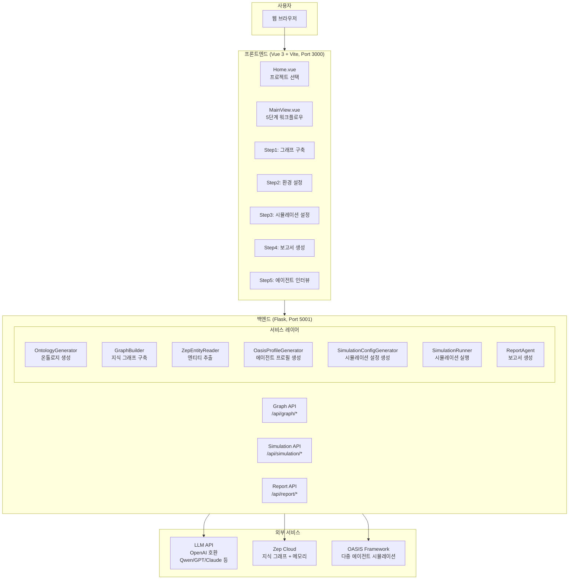
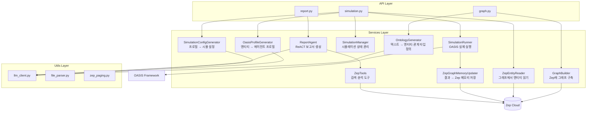
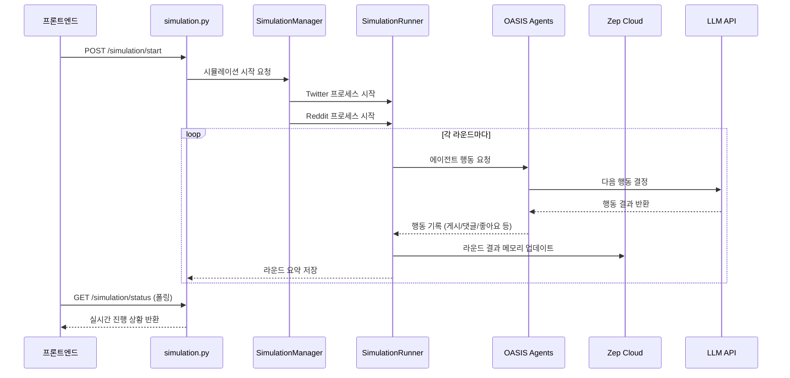
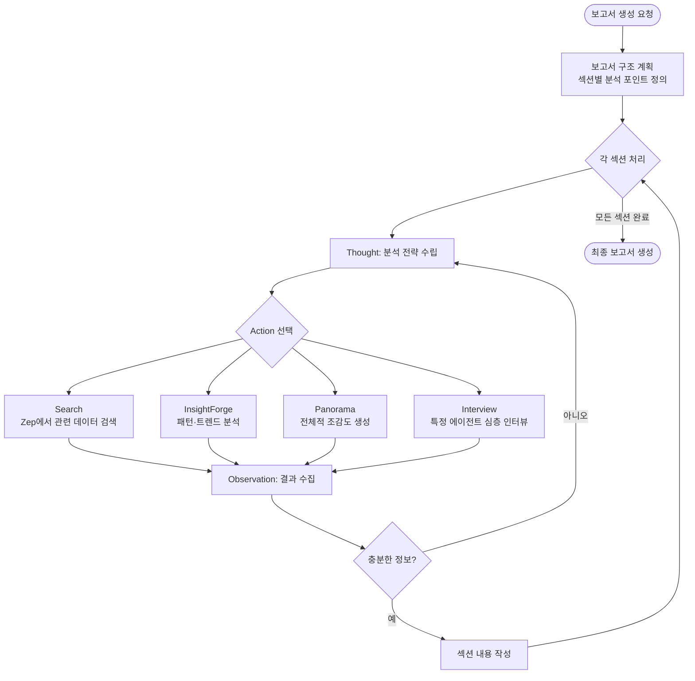

# MiroFish 프로젝트 구조 설명

> **MiroFish**는 AI 기반 군집 지능 엔진으로, 뉴스/정책 문서 등 시드 정보를 입력받아 수천 명의 지능형 에이전트가 자율 상호작용하는 디지털 세계를 구축하고 미래를 예측하는 시스템입니다.

---

## 전체 아키텍처 개요



---

## 5단계 워크플로우 (핵심 흐름)

```mermaid
flowchart LR
    INPUT[/"📄 입력\n뉴스/정책문서/데이터"/]

    subgraph STEP1["1단계: 지식 그래프 구축"]
        A1[파일 업로드\nPDF/MD/TXT]
        A2[온톨로지 생성\nLLM으로 엔티티·관계 타입 정의]
        A3[Zep에 지식 그래프 구축]
    end

    subgraph STEP2["2단계: 환경 설정"]
        B1[그래프에서 엔티티 추출]
        B2[에이전트 프로필 생성\n성격·행동 패턴 정의]
    end

    subgraph STEP3["3단계: 시뮬레이션 설정"]
        C1[시뮬레이션 요구사항 입력\n자연어로 설명]
        C2[시뮬레이션 파라미터 자동 생성\n라운드 수, 이벤트, 타임라인]
    end

    subgraph STEP4["4단계: 시뮬레이션 실행"]
        D1[Twitter 플랫폼 시뮬\n게시, 좋아요, 리트윗 등]
        D2[Reddit 플랫폼 시뮬\n포스팅, 댓글, 투표 등]
        D3[결과를 Zep 그래프에 저장]
    end

    subgraph STEP5["5단계: 보고서 & 인터뷰"]
        E1[예측 분석 보고서 생성\nReACT 패턴]
        E2[에이전트 심층 인터뷰\n개별 에이전트와 대화]
    end

    INPUT --> STEP1
    STEP1 --> STEP2
    STEP2 --> STEP3
    STEP3 --> STEP4
    STEP4 --> STEP5
    STEP4 -.->|메모리 업데이트| ZEP2[(Zep Cloud)]
```



---

## 디렉토리 구조

```
MiroFish/
├── 📄 README.md                    # 중국어 문서
├── 📄 README-EN.md                 # 영어 문서
├── 📄 docker-compose.yml           # Docker 배포 설정
├── 📄 package.json                 # npm 스크립트 (dev, build 등)
│
├── 🗂️ backend/                     # Python 백엔드
│   ├── run.py                     # Flask 앱 실행 진입점
│   ├── requirements.txt           # Python 의존성
│   └── app/
│       ├── __init__.py            # Flask 앱 팩토리
│       ├── config.py              # 환경변수 설정
│       ├── models/                # 데이터 모델
│       │   ├── project.py         # 프로젝트 상태 관리
│       │   └── task.py            # 비동기 태스크 추적
│       ├── api/                   # REST API 엔드포인트
│       │   ├── graph.py           # 그래프 관련 API
│       │   ├── simulation.py      # 시뮬레이션 관련 API
│       │   └── report.py          # 보고서 관련 API
│       ├── services/              # 핵심 비즈니스 로직
│       │   ├── ontology_generator.py        # 온톨로지 생성
│       │   ├── graph_builder.py             # Zep 그래프 구축
│       │   ├── zep_entity_reader.py         # 엔티티 추출
│       │   ├── oasis_profile_generator.py   # 에이전트 프로필 생성
│       │   ├── simulation_config_generator.py# 시뮬레이션 설정 생성
│       │   ├── simulation_manager.py        # 시뮬레이션 상태 관리
│       │   ├── simulation_runner.py         # OASIS 시뮬레이션 실행
│       │   ├── zep_graph_memory_updater.py  # 시뮬결과 → Zep 저장
│       │   ├── report_agent.py              # 보고서 생성 에이전트
│       │   └── zep_tools.py                 # 보고서 에이전트 도구
│       └── utils/                 # 유틸리티
│           ├── llm_client.py      # LLM API 클라이언트
│           ├── file_parser.py     # PDF/MD/TXT 파싱
│           └── retry.py           # 재시도 데코레이터
│
└── 🗂️ frontend/                    # Vue 3 프론트엔드
    ├── package.json               # Node 의존성
    └── src/
        ├── main.js                # 앱 진입점
        ├── App.vue                # 루트 컴포넌트
        ├── views/                 # 페이지 컴포넌트
        │   ├── Home.vue           # 랜딩 페이지
        │   ├── MainView.vue       # 5단계 워크플로우 페이지
        │   ├── SimulationRunView.vue # 시뮬레이션 실행 모니터링
        │   ├── ReportView.vue     # 보고서 표시
        │   └── InteractionView.vue# 에이전트 인터뷰
        ├── components/            # 재사용 컴포넌트
        │   ├── Step1GraphBuild.vue# 그래프 구축 UI
        │   ├── Step2EnvSetup.vue  # 환경 설정 UI
        │   ├── Step3Simulation.vue# 시뮬레이션 설정 UI
        │   ├── Step4Report.vue    # 보고서 생성 UI
        │   ├── Step5Interaction.vue# 에이전트 인터뷰 UI
        │   ├── GraphPanel.vue     # D3.js 그래프 시각화
        │   └── HistoryDatabase.vue# 프로젝트 히스토리
        ├── api/                   # API 클라이언트
        │   ├── graph.js
        │   ├── simulation.js
        │   └── report.js
        └── router/                # Vue Router 설정
```

---

## 백엔드 서비스 상세 관계도



---

## 시뮬레이션 실행 흐름 (Step 4 상세)



---

## 보고서 생성 흐름 (ReACT 패턴)



---

## 기술 스택 요약

| 영역 | 기술 |
|------|------|
| **프론트엔드** | Vue 3 (Composition API), Vite, Axios, D3.js |
| **백엔드** | Python, Flask 3.0+, uv (패키지 관리) |
| **LLM** | OpenAI SDK (Qwen/GPT/Claude 호환) |
| **지식 그래프** | Zep Cloud (엔티티·관계 추출 + 메모리) |
| **시뮬레이션** | OASIS Framework (camel-oasis, camel-ai) |
| **배포** | Docker, Docker Compose |

---

## 환경 변수 설정 (.env)

```env
# LLM 설정 (OpenAI 호환 API)
LLM_API_KEY=your_api_key
LLM_BASE_URL=https://dashscope.aliyuncs.com/compatible-mode/v1
LLM_MODEL_NAME=qwen-plus

# Zep Cloud
ZEP_API_KEY=your_zep_api_key

# Flask (선택)
FLASK_DEBUG=True
FLASK_HOST=0.0.0.0
FLASK_PORT=5001
```

---

## 빠른 시작

```bash
# 의존성 설치
npm run setup:all

# 개발 서버 실행 (프론트 3000 + 백엔드 5001)
npm run dev

# Docker로 실행
cp .env.example .env
docker compose up -d
```
